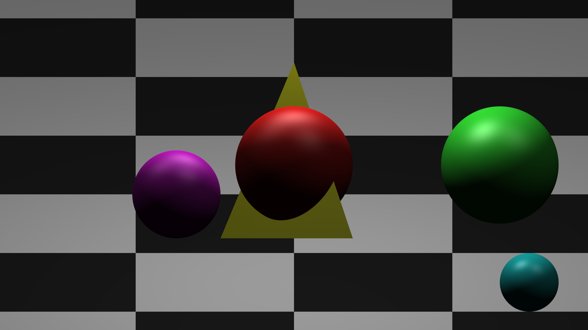

<<<<<<< HEAD
<<<<<<< HEAD
# MP2 --- Basic Ray Tracer with BVH
=======
# MP1 --- Basic Ray Tracer
>>>>>>> mp1
=======
# Basic Ray Tracer with BVH
>>>>>>> updated README for BVH

Objects:

* Spheres

* Planes (and checkered planes)

* Triangles

Light Types:

* Ambient lights

* Directional lights

* Point lights

Lighting (via Phong Reflection Model):

* Ambient

* Diffuse

* Specular

* HDR tone-mapping via gamma-compression

Projections:

* Orthographic

* Perspective

Other Goodies:

* Accelerated with bounding volume hierarchies

* Arbitrary image size support

* Anti-aliasing support (arbitrary positive integers)

* Multithread support

* Specify output file

## Sample Images

Perspective image

Orthographic image

Bounding Volume Hierarchy demo with 2^18 spheres

