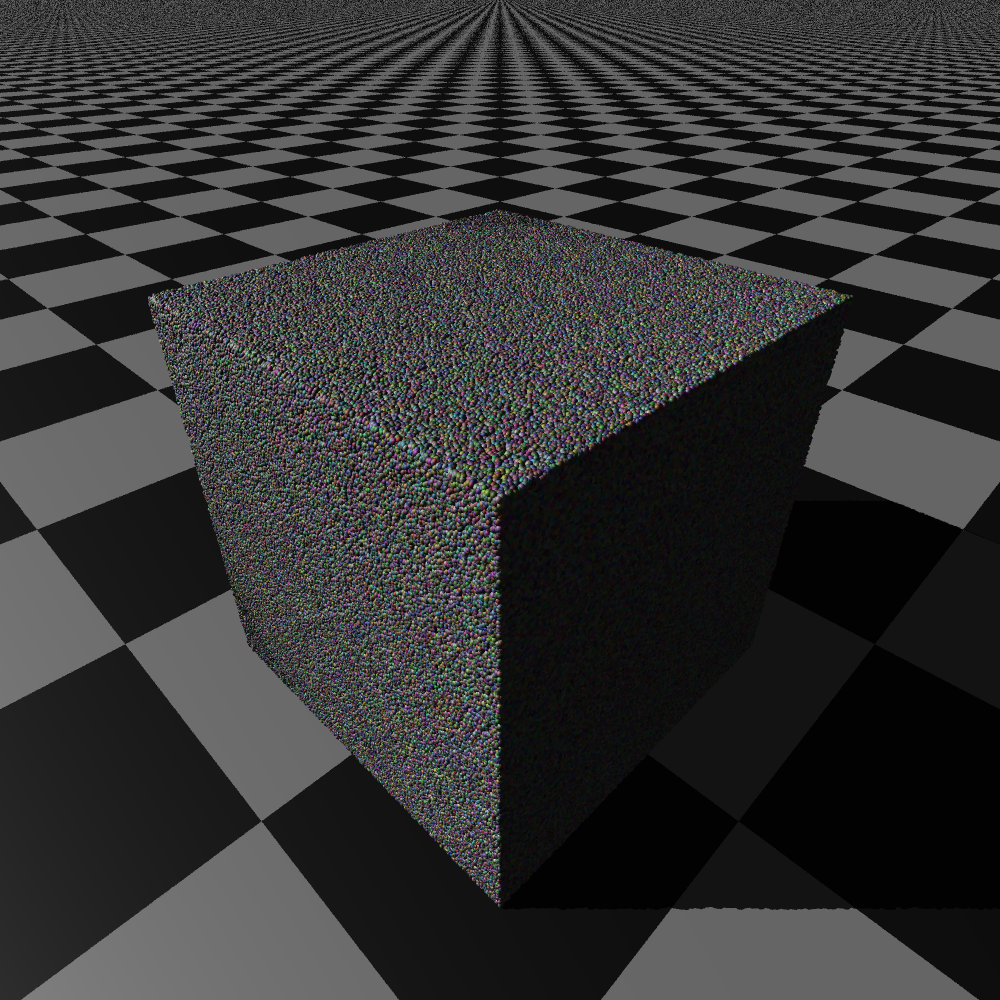

# Basic Ray Tracer

### Objects:

* Spheres

* Planes (and checkered planes)

* Triangles

### Light Types:

* Ambient lights

* Directional lights

* Point lights

### Lighting (via Phong Reflection Model):

* Ambient

* Diffuse

* Specular

* HDR tone-mapping via gamma-compression

* Smooth (Phong) shading

### Projections:

* Orthographic

* Perspective

* Adjustable camera

### Other Goodies:

* Acceleration of large number of objects via a bounded volume hierarchy

* Arbitrary image size support

* Anti-aliasing support (arbitrary positive integers)

* Multithreading support

* Shadows

* Basic .obj file import

## Sample Images

### Perspective image

### Orthographic image

### Imported Mesh

### Smooth Shading

## Bounding Volume Hierarchy

### Scenes with many objects can be accelerated with a BVH

### Test with 2^24 spheres

